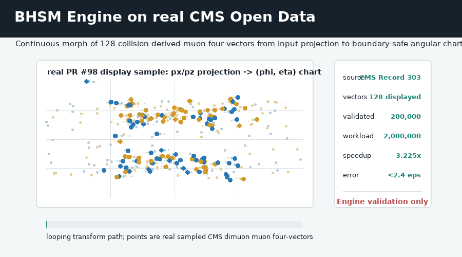

# Berger-Hopf Standard Model (BHSM)

[](https://github.com/ncarberry64/Berger-Hopf-Standard-Model/actions/workflows/ci.yml) [](https://github.com/ncarberry64/Berger-Hopf-Standard-Model/releases/latest) [](https://www.python.org/) [](https://doi.org/10.5281/zenodo.20663419)

The Berger-Hopf Standard Model (BHSM) is an artifact-backed Python research framework for mathematical and high-energy physics. It studies candidate connections among Berger spheres, Hopf fibrations, differential geometry, Standard Model flavor structure, gauge actions, CKM/PMNS matrices, and reproducible CERN ROOT/Open Data workflows.

It provides an artifact-backed computational framework with Python interfaces, provenance-tracked adapters, review tools, and theorem-closure machinery. Institutional integration, complete 4D export, and external HEP runtime validation remain outside the package.

## BHSM Engine on real CMS Open Data


This offline animation uses a compact deterministic sample from the PR #98 CMS Open Data validation path: CERN Open Data Record 303, DOI `10.7483/OPENDATA.CMS.4M97.3SQ9`. PR #98 validated coordinate transformations on 200,000 unique CMS dimuon muon four-vectors, with a 2,000,000-vector timed workload, 3.225x speedup versus the vectorized control, and backward error below 2.4 machine-epsilon. [Static SVG and provenance](docs/pr98_cms_open_data_animation.md).

Scope boundary: Engine coordinate-transformation validation only. This is not detector reconstruction, empirical validation of BHSM Physics, or CMS/CERN endorsement.

The earlier [near-pole animation](docs/assets/bhsm_boundary_mapping_explainer.gif) remains a synthetic coordinate-stability demonstration, not a detector failure.

## Computational Quickstart (30 Seconds)

```bash
git clone https://github.com/ncarberry64/Berger-Hopf-Standard-Model.git
cd Berger-Hopf-Standard-Model && ./run_benchmark.sh
```

Windows PowerShell: `./run_benchmark.ps1`. Docker instructions and the optional [CERN ROOT adapter](integrations/cern-root/README.md) include generic-safe CMake installation plus opt-in AVX2/AVX-512 flags for homogeneous nodes.

## What This Repository Contains

- frozen BHSM internal prediction artifacts;
- an offline Python computational interface and prediction registry;
- provenance-tracked adapters for CKM, PMNS, CP phase, boundary constants, and
  mass ratios;
- prediction gallery, plotting, and parse-only notebook review tools;
- explicit theorem blockers and proof-gate machinery;
- a callable symbolic CP `O_int` field/action candidate;
- disabled external HEP workflows awaiting the required theorems and live
  runtime validation.

## Current Public Status

BHSM is an artifact-backed computational framework for Berger-Hopf boundary-mode physics. Current public status: structural architecture integrated conditional; frozen predictions unchanged; physical eV/GeV neutrino mass closure remains open; external HEP runtime integration remains gated.

| Area | Status | Summary |
| --- | --- | --- |
| Frozen predictions | `ESTABLISHED` | Versioned internal artifacts remain unchanged. |
| Python interface and CLI | `ESTABLISHED` | Deterministic offline registry, reports, and artifact commands are executable. |
| CKM, PMNS, CP phase, boundary constants, mass ratios | `ARTIFACT_BACKED` | Local artifacts load with provenance. |
| CP/Z6 holonomy | `ARTIFACT_BACKED` | The holonomy and CKM/PMNS phase attachment are local artifact-backed constraints; standalone `O_int` production is a retired target. |
| `X_ch` | `CONDITIONAL_ACTION_THEOREM` | Author ontology defines a charged boundary-response operator; numerical and 4D production closure remain open. |
| Neutrino BHSM mass | `CONDITIONAL_NUMERICAL_CLOSURE_CANDIDATE` | Local no-fit artifacts support a dimensionless propagation-threshold response; the eV/GeV scale remains open. |
| Neutral dimensionful scale | `OPEN_MISSING_NEUTRAL_SCALE` | The local audit finds no physical unit anchor, normalized boundary measure, or threshold-to-energy map. |
| Legacy curvature mass bridge | `ARTIFACT_BACKED_CURVATURE_MASS_FUNCTIONAL` | Author-supplied papers provide the geometric matching functional; physical `r_prop` and `k_neutral,eff` remain open. |
| Neutral propagation radius | `CONDITIONAL_PROPAGATION_RADIUS_CANDIDATE` | A symbolic length-domain candidate is defined; no numerical value in metres is derived. |
| Neutral physical curvature map | `CONDITIONAL_PHYSICAL_CURVATURE_MAP_CANDIDATE` | A symbolic `kappa_curv R_nu` map is defined; `kappa_curv` in `m^-2` remains open. |
| Dimensionful neutrino mass | `DIMENSIONFUL_MASS_NOT_AVAILABLE` | Numeric unit inputs are absent, and the legacy `r^2 k` functional has dimension mass/length under `K=-nabla^2 ln rho`. |
| Neutral mass-gap action | `ARTIFACT_BACKED_MASS_GAP_ACTION` | The scalar topographic action analogue is artifact-backed; its neutral normalization is conditional. |
| Neutral spectral gap | `CONDITIONAL_NEUTRAL_SPECTRAL_MASS_CANDIDATE` | `m_nu c^2 = hbar c sqrt(A_nu/Z_nu) K_neutral,eff`; numeric stiffness length and physical curvature remain open. |
| Neutral kernel positivity | `CONDITIONAL_MEASUREMENT_SUPPORTED_NEUTRAL_POSITIVITY_CANDIDATE` | Raw PSD is false; exact copositivity holds on the author-ontology response cone without thresholding. |
| Neutral action normalization | `OPEN_MISSING_NEUTRAL_ACTION_NORMALIZATION` | Partial variational boundary/collar action exists; coefficient, measure, profile, and unit normalization remain open. |
| Action-supported response cone | `CONDITIONAL_ACTION_DERIVED_RESPONSE_CONE_CANDIDATE` | Existing action terms partially support the cone; complete-action derivation remains open. |
| Full-completion audit | `FULL_BHSM_NOT_COMPLETE` | v4.2 finds only conditional orthonormal-coframe compatibility; equal weighting, `1/3` normalization, gauge attachment, CKM, scale, and transport remain open. |
| Charged closure audit | `CONDITIONAL_CHARGED_SOURCES` | Charged coefficients are inventoried; action normalization and CKM exponent derivation remain open. |
| Normalized action CKM adjoint-pair audit | `OPEN_MISSING_NORMALIZED_ACTION_ADJOINT_PAIR_SELECTION` | Hermitian bidirectional count is conditional; normalized-action CKM transport-space selection remains open. |
| FeynRules, UFO, MadGraph | `RUNTIME_GATED` | External validation is deferred until theorem and runtime gates pass. |

[STATUS.md](STATUS.md) is the single source of truth. Historical README material is preserved in
[docs/archive/README_status_history_pre_v0_7.md](docs/archive/README_status_history_pre_v0_7.md).

## Reviewer Quickstart

Run `python -m pytest -q`, then see [QUICKSTART.md](QUICKSTART.md) and [CLI_REFERENCE.md](CLI_REFERENCE.md) for the complete offline review surface.

The legacy gravitational curvature expression is dimensionally gated because K has units L^-2 and (c^2/G) r^2 K has units M/L, not M.
BHSM does not use the legacy gravitational curvature expression as a direct particle mass formula.
The preferred particle-sector path is the conditional action-normalized neutral spectral gap. No physical neutrino mass is emitted by repository defaults.

The raw neutral kernel is not assumed positive semidefinite. BHSM distinguishes raw-kernel, conditional admissible-cone, and thresholded-response nonnegativity.

BHSM has conditional dimensionless neutrino propagation closure, a conditional neutral spectral-mass theorem, and conditional measurement-supported admissible neutral positivity. Physical eV/GeV neutrino mass closure remains open pending a numeric neutral stiffness length sqrt(A_nu/Z_nu), a physical K_neutral,eff map in m^-2, and complete-action derivation of the admissible response cone.

See [QUICKSTART.md](QUICKSTART.md) for a runnable walkthrough and [CLI_REFERENCE.md](CLI_REFERENCE.md) for the complete command table.

## Established Artifact-Backed Outputs

The authoritative frozen records are
[docs/frozen_predictions.md](docs/frozen_predictions.md) and
[docs/frozen_predictions.json](docs/frozen_predictions.json). The frozen branches remain `BHSM_BARE_V1` and
`BHSM_DRESSED_V1_CANDIDATE`; this cleanup changes neither branch.

The adapter layer exposes local CKM and PMNS matrices, the CP holonomy phase,
boundary constants, and frozen mass ratios. Each result carries source path,
source status, and derivation-input provenance. Formula availability does not
upgrade an open theorem.

See [ARTIFACT_INDEX.md](ARTIFACT_INDEX.md) and run:

```bash
python -m bhsm.interface compute-artifact CKM_matrix_BHSM
python -m bhsm.interface compute-artifact PMNS_matrix_BHSM
python -m bhsm.interface artifact-report --anchor W_boson --format json
```

## Candidate And Open Theorem Areas

CP phase attachment to CKM/PMNS structures is artifact-backed. The v0.8 author
ontology classifies CP as a Z6 boundary holonomy constraint and retires the
standalone `O_int` production target. It defines `X_ch` conditionally as a
charged boundary-response operator and the neutrino BHSM mass conditionally as
a propagation-locked curvature response. These are structural theorem statuses;
numerical closure and external HEP runtime readiness remain open.

The v0.9 neutrino module evaluates the conditional dimensionless law
`tau max(0, p g_nu ||K_nu psi||/||psi|| - kappa_nu)`. In BHSM, the neutrino
mass contribution is modeled as a propagation-locked curvature response, not
as an ordinary static rest-mass primitive. No dimensional neutrino mass is
claimed because an artifact-backed neutral eV/GeV scale is absent.

BHSM currently distinguishes dimensionless neutrino propagation closure from physical eV/GeV mass closure.
A physical eV/GeV neutrino mass requires an artifact-backed or explicitly conditional neutral dimensionful scale.
The electron-neutrino upper limit is a comparison reference only and is never used to set the neutral scale.
A dimensionless BHSM response is not, by itself, a physical eV/GeV mass.

Run the offline scale audit with:

```bash
python -m bhsm.interface neutral-scale-candidates --format json
python -m bhsm.interface neutrino-scale-report --format markdown
python -m bhsm.interface legacy-neutral-scale-report --format markdown
python -m bhsm.interface neutral-radius-curvature-report --format markdown
```

The legacy curvature-threshold mass functional supplies a candidate mass bridge, not an empirical neutrino mass prediction by itself. A physical BHSM neutrino mass requires both a propagation/localization scale and a neutral curvature mapping with physical units.

The v1.2 dimensional audit adds a further required gate: the mass functional itself must reduce to physical mass. The currently documented `r^2 k` expression does not pass that gate when `K` has dimension `length^-2`.

The exact evidence boundary is reported by:

```bash
python -m bhsm.interface theorem-blockers
python -m bhsm.interface minimal-action-report --format markdown
```

Long-form mathematical status remains available in
[docs/current_bhsm_status.md](docs/current_bhsm_status.md),
[theory/full_bhsm_completion_v1_candidate.md](theory/full_bhsm_completion_v1_candidate.md),
and [theory/full_bhsm_open_proof_obligations.md](theory/full_bhsm_open_proof_obligations.md).

## Claim Boundaries

See [CLAIMS.md](CLAIMS.md). W calibration is not an independent prediction, and
the electron-neutrino comparison remains upper-limit based.

## Engine and Physics Status

The BHSM Engine validates high-throughput, precision-gated geometric coordinate transformations on synthetic and real HEP kinematic data.
BHSM Engine validation does not constitute empirical validation of BHSM as new particle physics.
BHSM Physics remains an integrated conditional Berger-Hopf boundary-mode framework with open action, transport, normalization, unit-map, gauge/scalar, and runtime gates.
BHSM does not claim full Standard Model derivation or physical eV/GeV neutrino mass closure.

Start with `make reviewer-smoke` and the [reproduction guide](docs/reviewer_reproduction_guide.md).
The primitive lattice normalization rule is not action-derived unless the BHSM action is shown to quotient common incidence rescalings.
The maximal-overlap bridge rule is not action-derived unless the BHSM charged bridge/Hessian action selects the maximal primitive overlap channel.
The abstract log-transport averaging lemma does not by itself derive the CKM exponent. The normalized charged-current action term, not arithmetic channel-count coincidence, must select the CKM transport space. The one-way up/down channel count is 8. The Hermitian adjoint-pair channel count is 16, but the CKM exponent remains not derived unless BHSM proves CKM acts on that selected transport space. The existence of a Hermitian-conjugate term supports action reality but does not by itself derive CKM transport-space selection. Same numerical dimension does not establish the physical source. The maximal self-response channel also has dimension 16, but it is retired as the primary CKM source unless action evidence revives it. No empirical CKM fitting, charged-mass fitting, PDG values, W calibration, neutrino limits, or legacy threshold tables are used as theorem inputs. Runtime-Gated External Tools remain separate.
## Repository Map
| Path | Purpose |
| --- | --- |
| `src/bhsm/interface/` | Python registry, adapters, reports, and theorem-closure interface |
| `artifacts/` | Machine-readable outputs and status records |
| `docs/` | Current guides plus indexed historical handoff documentation |
| `theory/` | Mathematical and theorem-development records |
| `notebooks/` | Parse-only reviewer notebooks |
| `tests/` | Numerical, provenance, claim-boundary, and frozen-integrity tests |

Start with [docs/README.md](docs/README.md) for the documentation map and
[ROADMAP.md](ROADMAP.md) for the next work sequence.
## Citation
Use [CITATION.cff](CITATION.cff) for current citation metadata.
## v2.9 CKM Coefficient Form/Value Split
The interface coefficient form `C_CKM=g2_BH/sqrt(2)` is artifact-backed, while `g2_BH` remains a runtime input rather than an action-derived value. The v3.1 audit finds the `alpha_i=w_i/(6*pi^2)` registry pattern artifact-backed and the `1:2:7` sector-weight source conditional, but the volume denominator, universal quantum, action attachment, coupling values, CKM coefficient value, and CKM exponent remain open.
