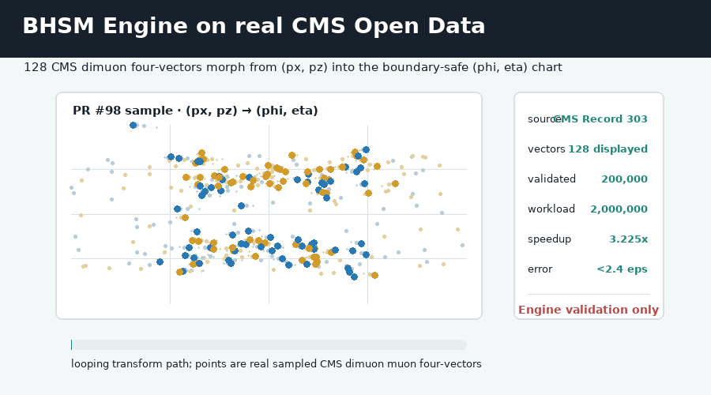

# Berger-Hopf Standard Model (BHSM)

[](https://github.com/ncarberry64/Berger-Hopf-Standard-Model/actions/workflows/ci.yml)
[](https://github.com/ncarberry64/Berger-Hopf-Standard-Model/releases/latest)
[](https://www.python.org/)
[](https://doi.org/10.5281/zenodo.20663419)

BHSM is an artifact-backed computational framework for Berger-Hopf boundary-mode physics. Current public status: v8.3 exhausts the basis-free projected-spectral route. The exact associated-scalar operator is metric dependent and the legacy Berger proxy gives explicit diagonal derivatives, but no action-derived intertwiner realizes the frozen `(k,j,q)` ledger as that operator's normalized spectrum. Action-canonical stresses, response matrices, mass ratios, and CKM therefore remain undefined, with RB-15/RB-16 blocked.

This independent mathematical-physics project investigates whether
Berger-Hopf boundary geometry can organize structures associated with
Standard Model fields, flavor, generations, interactions, and dimensional
emergence. It records calculations and candidate relationships; it has not
received empirical validation, completed a derivation or replacement of the
Standard Model, or received institutional endorsement.

## Start Here: BHSM in Plain Language

- [BHSM in plain language](docs/bhsm_in_plain_language.md)
- [Public scientific handoff](docs/bhsm_public_scientific_handoff_v6_21_0.md)
- [Scientific contribution ledger](docs/bhsm_scientific_contribution_ledger.md)
- [CERN toy model in plain language](docs/cern_toy_model_in_plain_language.md)
- [STATUS.md](STATUS.md) and [claim boundaries](CLAIMS.md)
- [BHSM v8.2 generation-projector action attachment](docs/bhsm_generation_projector_action_attachment_v8_2.md)
- [BHSM v8.3 classical mode-stress incidence](docs/bhsm_classical_mode_stress_incidence_v8_3.md)
- [Reviewer reproduction guide](docs/reviewer_reproduction_guide.md)
- [Frozen records](docs/frozen_predictions.md) and [artifact index](ARTIFACT_INDEX.md)

Historical sprint reports remain in the [documentation index](docs/README.md)
as evidence and provenance, not competing current-status pages.

## Current Public Status

| Area | Classification | Evidence boundary |
| --- | --- | --- |
| Computational engine | Numerically validated | Coordinate transforms, precision gates, provenance adapters, and offline reports execute. |
| Frozen artifacts | Derived consequence | Versioned records and byte-integrity guards exist; comparison data are not derivation inputs. |
| Threading response | Derived consequence | `Pi_perp S_Sigma = -tau (pi chi_1/16) Pi_perp q` on the declared domain. |
| Homogeneous threading | Adopted BHSM axiom | `C_Sigma=0` in the source-free resting configuration. |
| Lapse--Weyl block | Derived consequence | The principal bulk block and radial measure are action-derived. |
| Fold kinetic classification | Active construction target | Mixed source, boundary domain, Schur complement, and sign remain open. |
| Dimensionless core action | Internally complete, finite-input stratified EFT | The v7.1 correspondence action owns every retained term; physical scheme/observable transport remains open. |
| External physics test | Needs empirical test | Engine tests do not validate BHSM particle physics. |

The threading response is derived and no explicit energy threshold is
required. The lapse--Weyl principal block is derived. The historical fold
target below remains a conditional operator problem, but it is no longer the
highest-upstream BHSM 1.0 gate. The live target is the common
scheme/observable transport functor identified by v7.1. The fold construction
had targeted the gauge-quotiented metric tangent

```text
T_mu_nu^(X) (x,x')
  = delta hbar_mu_nu[X] (x) / delta X(x') evaluated at X=2,
delta R_4[T^(X)] = tau chi_1 q.
```

At `X_c=2`, `N_0=pi/4`, and
`a_0(t)=sqrt(2) sin(pi t/4)`, the radial measure is
`pi sin^4(pi t/4) dt`, and the principal block is
`[[0,6 kappa_1/a_0^2],[6 kappa_1/a_0^2,12 kappa_1/a_0^2]]`.

The scalar curvature response does not uniquely specify a symmetric metric
tangent, gauge representative, or boundary domain. Therefore the mixed
source, B1/matcher conditions, adjoint kernels, compatibility, and Schur
complement remain open. The fold kinetic sign is unresolved. No physical mass
claim follows, nor does any ghost, null, tachyon, nonlinear-stability,
production, or white-hole dynamics claim.

BHSM has conditional dimensionless neutrino propagation closure, a conditional neutral spectral-mass theorem, and conditional measurement-supported admissible neutral positivity. Physical eV/GeV neutrino mass closure remains open pending a numeric neutral stiffness length sqrt(A_nu/Z_nu), a physical K_neutral,eff map in m^-2, and complete-action derivation of the admissible response cone.

## BHSM Engine on real CMS Open Data



The checksum-pinned PR #98 path uses CERN Open Data Record 303, DOI
`10.7483/OPENDATA.CMS.4M97.3SQ9`, to test coordinate transformations on
collision-derived four-vectors. Scope: Engine coordinate-transformation validation only.
It is not detector reconstruction, a BHSM physics test, or CERN/CMS
endorsement. See the [benchmark record](docs/cern_open_data_benchmark.md).

The earlier [near-pole animation](docs/assets/bhsm_boundary_mapping_explainer.gif)
is a synthetic coordinate-stability demonstration, not a detector failure.

## Computational Quickstart (30 Seconds)

BHSM supports Python 3.10 or newer:

```bash
git clone https://github.com/ncarberry64/Berger-Hopf-Standard-Model.git
cd Berger-Hopf-Standard-Model
python -m venv .venv
source .venv/bin/activate
python -m pip install -e .
make reviewer-smoke
```

On Windows activate with `.\.venv\Scripts\Activate.ps1`. Without `make`, run:

```bash
python -m pytest -q tests/test_engine_invariant_preservation.py tests/test_engine_physics_status_separation.py
python -m bhsm.interface --help
python -m bhsm.interface registry
python -m bhsm.interface physics-status --format markdown
python tools/audit_public_readiness.py
```

See [QUICKSTART.md](QUICKSTART.md) and
[CLI_REFERENCE.md](CLI_REFERENCE.md) for the complete offline review surface.

## Established Artifact-Backed Outputs

The authoritative frozen records remain `BHSM_BARE_V1` and
`BHSM_DRESSED_V1_CANDIDATE`; this handoff changes neither. The repository
also provides a prediction gallery, provenance adapters, theorem-blocker
reports, symbolic action candidates, and deterministic sprint artifacts.

## Candidate And Open Theorem Areas

The live synthesis is in
[current_bhsm_status](docs/current_bhsm_status.md),
[full_bhsm_completion_v1_candidate](theory/full_bhsm_completion_v1_candidate.md),
and [open proof obligations](theory/full_bhsm_open_proof_obligations.md).
These distinguish artifact-backed formulas and conditional response laws from
unproved completion, physical-scale, and empirical claims.

## Engine Validation Versus Physics Validation

Engine tests do not validate BHSM as particle physics. Engine correctness
means tested software and numerical transformations; physics validation
requires independent experimental comparison and successful derivations.

## Runtime-Gated External Tools

ROOT, CERN Open Data downloads, plotting, native compilation, FeynRules, UFO,
MadGraph, and hardware profiling are optional or runtime-gated. They are not
required for the offline reviewer smoke and are not collider-readiness claims.

## What This Repository Contains

Executable interfaces, deterministic artifacts, frozen records, geometric
and variational derivations, theorem-development records, tests, audits, and
optional external-runtime adapters.

## Repository Map

| Path | Purpose |
| --- | --- |
| `src/bhsm/interface/` | Python registry, reports, action audits, and interfaces |
| `artifacts/` | Machine-readable evidence and status records |
| `docs/`, `theory/` | Reviewer guides, derivations, and historical handoffs |
| `tests/`, `tools/` | Reproduction tests and offline audits |
| `integrations/` | Optional external-runtime adapters |

## Claim Boundaries

BHSM does not claim a complete physical action, action-derived particle
masses or gauge couplings, a physical neutrino mass, a completed fold kinetic
classification, collider-production readiness, or institutional endorsement.
See [CLAIMS.md](CLAIMS.md).

## Citation and License

Use [CITATION.cff](CITATION.cff). The verified archival DOI is
[10.5281/zenodo.20663419](https://doi.org/10.5281/zenodo.20663419); the latest
GitHub release and DOI snapshot have distinct version labels. Reuse is
governed by [LICENSE.md](LICENSE.md).

For critique or changes, read [CONTRIBUTING.md](CONTRIBUTING.md), use the
[research template](.github/ISSUE_TEMPLATE/research-source.yml) or
[bug template](.github/ISSUE_TEMPLATE/bug-report.yml), and route security
reports through [SECURITY.md](SECURITY.md).

The authoritative action assessment is the
[v7.1 covariant bulk--boundary reduction](docs/bhsm_covariant_bulk_boundary_reduction_functor_v7_1.md).
It constructs the oriented \(M_8\to M_5\) pushforward on the retained
subcategory and adopts a stratified correspondence action for independently
owned cap and boundary-localized fields. The dimensionless finite-input core
is internally closed; physical scheme/observable transport remains open.
