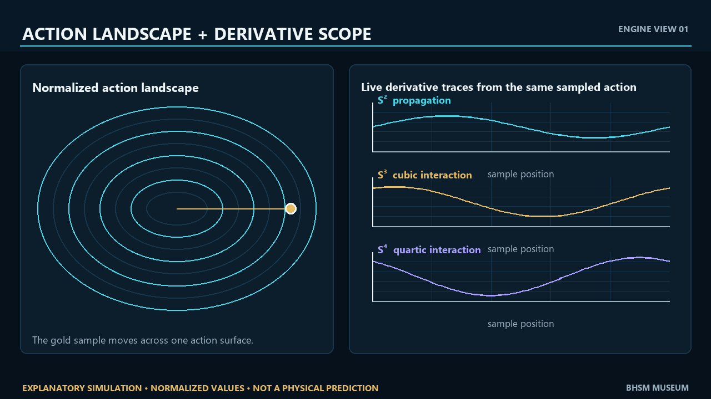
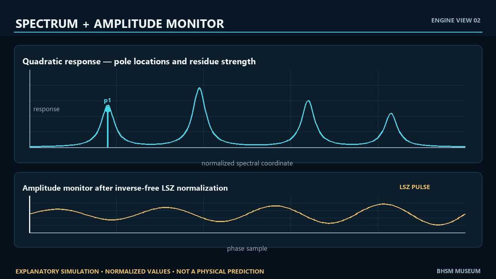
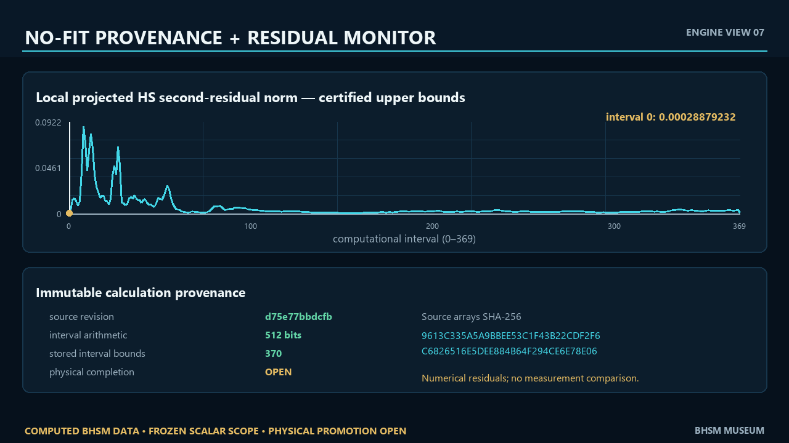
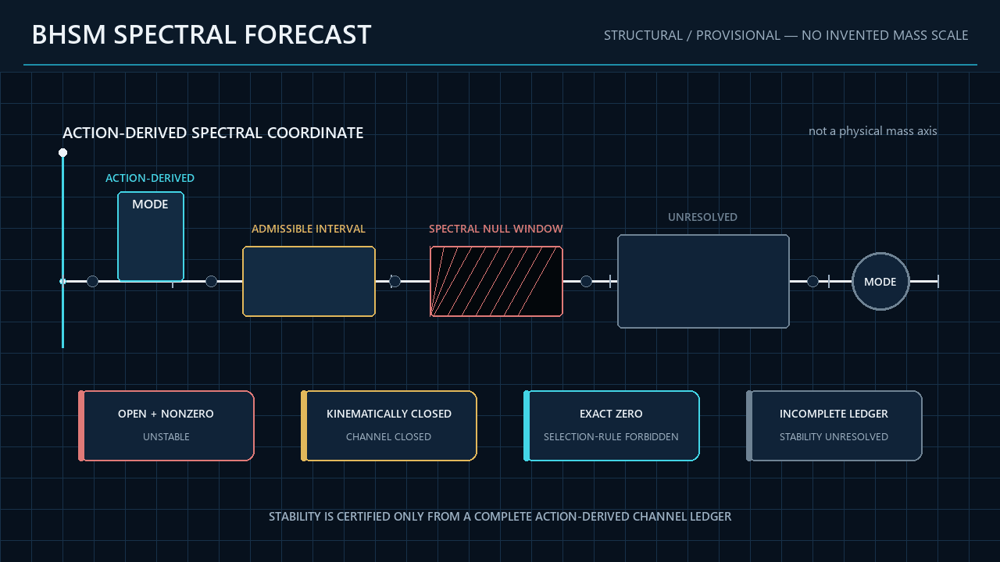
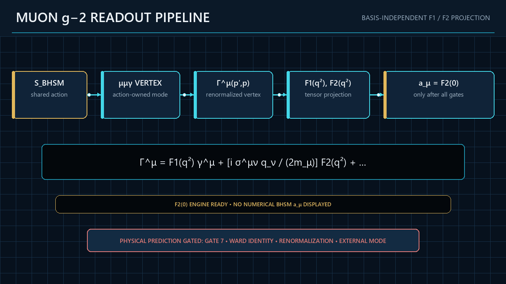
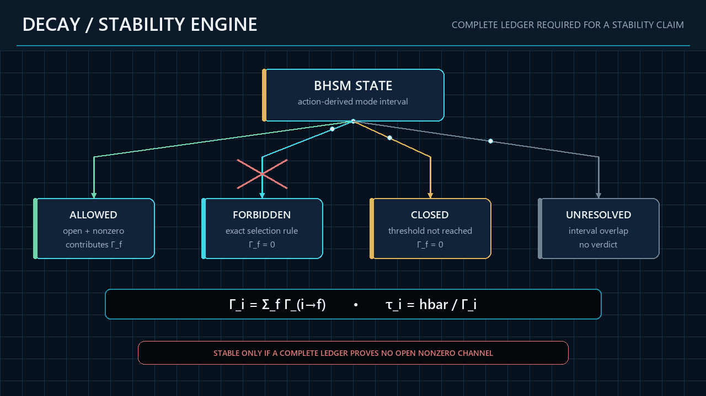
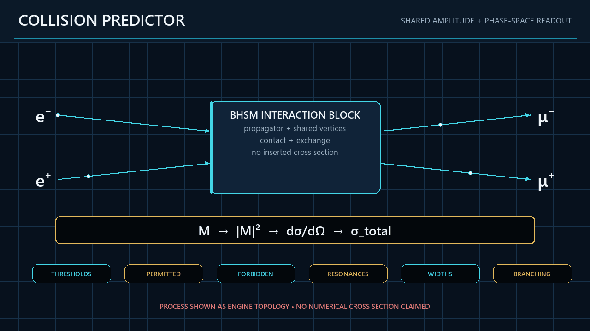

# Berger-Hopf Standard Model (BHSM)

[](https://github.com/ncarberry64/Berger-Hopf-Standard-Model/actions/workflows/ci.yml)
[](https://github.com/ncarberry64/Berger-Hopf-Standard-Model/releases/latest)
[](docs/current_bhsm_status.md)
[](https://www.python.org/)
[](https://doi.org/10.5281/zenodo.20663419)



BHSM is an independent, artifact-backed computational framework and mathematical-physics research program investigating whether Berger-Hopf boundary/envelopment geometry and one retained action can generate particle-like modes, shared interactions, and observable readouts.

## One Action &middot; One Scale &middot; One Observable Pipeline



The engine differentiates the same retained local action through fourth order. `S^(2)` supplies the descriptor spectrum and propagators; `S^(3)` and `S^(4)` supply shared vertices; the resulting amplitude passes through on-shell normalization into common decay, collision, form-factor, and spectral classifiers. A single `G_F = c_F / Lambda^2` scale map forbids observable-by-observable retuning.

The [retained N12 action adapter](src/bhsm/interface/retained_n12_action_expansion_adapter.py)
cross-checks the action value, gradient, and Hessian before exposing higher
directional derivatives. This is implemented machinery, not a physical
promotion.

## No-Fit Prediction Firewall



Measured particle values may be used only downstream for declared comparison.
They may not choose an upstream branch, normalization, mode, formula,
renormalization scale, or action coefficient.

## Current Public Status

The newest integrated science descendant binds the universal expansion engine to the retained N12 local action and includes generalized poles/residues, guarded Standard Model gauge-vertex tensors, shared cubic and quartic vertices, tree amplitudes, two-body decay and `2 -> 2` collision phase space, `F1/F2` projection, interval spectral/stability classification, a same-action renormalization ledger, and the universal scale map.

| Statement class | Current BHSM status |
| --- | --- |
| Implemented machinery | Firmly testable as software and algebra |
| Numerically demonstrated behavior | Reported with its interval, resolution, and provisional qualifier |
| Physical predictions | Fail-closed unless frozen behind the no-fit firewall |

The Gate-7 geometric stop is closed and its background is frozen, but Gate 7 itself remains `ACTIVE_NOT_CLOSED`: the current blocker is same-center outward `Y`, `Z1`, and `Z2` satisfying both radii inequalities. No alternative numerical campaign is authorized. Physical promotion remains gated, frozen predictions remain unchanged, and empirical status is not established.

`FULL_BHSM_COMPLETE = FALSE`

Historical compatibility: the v18.73 rolling checkpoint records corrected-Rayleigh descent of the 376-variable system, complete-child reconstruction, eta admissibility, and persistence at residual `0.777030406838571`. Earlier v11.1 and v15.10 surfaces remain historical rather than current authority. The historical v15.10 exact-next-object token is
`ACTION_OWNED_AETHER_CYCLE_TO_REGULAR_SIGMA_RESPONSE_JET_MAP_PRODUCING_THE_PHYSICAL_SIGMA_TANGENT_PROPAGATOR_X_DERIVATIVE_AND_BACKREACTION_UNREDUCED_CANONICAL_QUARTIC_ON_THE_V15_9_BRANCH`.

This independent mathematical-physics project records calculations and
conditional relationships; it has not established BHSM as particle physics or
completed a derivation or replacement of the Standard Model.

## Predictive Spectrum



The interval engine distinguishes action-derived modes, admissible bands, null
windows, exact selection-rule zeros, kinematically closed channels, instability,
and unresolved ledgers. The repository does not yet emit a promoted physical
mass axis or frozen new-particle assignment, so the map is qualitative.

## Magnetic Moment



The electromagnetic readout resolves a supplied renormalized on-shell vertex
into `F1(q^2)` and `F2(q^2)`. No numerical BHSM `a_mu = F2(0)` is displayed:
Gate 7, Ward/Slavnov-Taylor closure, renormalization, external-mode selection,
and the zero-momentum limit must all pass first.

## Decays and Stability



The shared amplitude feeds two-body phase space and the interval channel ledger.
A state is called stable only when a complete ledger proves every channel closed
or exactly forbidden; otherwise the engine reports unstable or unresolved.

## Collision Prediction



The `2 -> 2` readout maps the shared amplitude to differential phase space while
retaining thresholds, averaging, symmetry factors, and channel status. The
displayed `e+ e- -> mu+ mu-` process is an engine topology, not a numerical
cross-section claim or statement of collider readiness.

## CMS / Real-Data Validation


The checksum-pinned PR #98 path uses CERN Open Data Record 303, DOI
`10.7483/OPENDATA.CMS.4M97.3SQ9`, to test coordinate transformations on
collision-derived four-vectors. Scope: Engine coordinate-transformation validation only.
It is not detector reconstruction, a BHSM physics test, or CERN/CMS endorsement.
See the [benchmark record](docs/cern_open_data_benchmark.md).

The earlier [near-pole animation](docs/assets/bhsm_boundary_mapping_explainer.gif)
is a synthetic coordinate-stability demonstration, not a detector failure.

## Start Here

- [BHSM in plain language](docs/bhsm_in_plain_language.md)
- [Scientific contribution ledger](docs/bhsm_scientific_contribution_ledger.md)
- [CERN toy model in plain language](docs/cern_toy_model_in_plain_language.md)
- [Current status](docs/current_bhsm_status.md), [STATUS.md](STATUS.md), and [CLAIMS.md](CLAIMS.md)
- [Reviewer reproduction guide](docs/reviewer_reproduction_guide.md)
- [Frozen predictions](docs/frozen_predictions.md) and [prediction gallery](docs/prediction_gallery.md)

## Computational Quickstart

```bash
git clone https://github.com/ncarberry64/Berger-Hopf-Standard-Model.git
cd Berger-Hopf-Standard-Model
python -m venv .venv
python -m pip install -e .
python -m pytest -q tests/test_engine_invariant_preservation.py tests/test_engine_physics_status_separation.py
python -m bhsm.interface physics-status --format markdown
```

See [QUICKSTART.md](QUICKSTART.md) and [CLI_REFERENCE.md](CLI_REFERENCE.md).

## Established Artifact-Backed Outputs

The frozen `BHSM_BARE_V1` and `BHSM_DRESSED_V1_CANDIDATE` records are unchanged.
The repository also contains deterministic sprint artifacts, theorem-blocker
reports, provenance adapters, and the prediction gallery.

## Candidate And Open Theorem Areas

See the [current synthesis](theory/full_bhsm_completion_v1_candidate.md) and
[open proof obligations](theory/full_bhsm_open_proof_obligations.md). These keep
historical screens, conditional theorems, and physical predictions distinct.

## Engine Validation Versus Physics Validation

Engine tests do not validate BHSM as particle physics. Software correctness and
numerical transformation checks are not empirical validation of BHSM Physics.

## Runtime-Gated External Tools

ROOT, CERN downloads, FeynRules, UFO, MadGraph, plotting, and native compilation
are optional or runtime-gated; their adapters are not collider-readiness claims.

## What This Repository Contains

Executable interfaces, deterministic artifacts, geometric and variational
derivations, reviewer guides, audits, tests, and optional runtime adapters.

## Repository Map

| Path | Purpose |
| --- | --- |
| `src/bhsm/interface/` | Action, spectrum, amplitude, and reporting interfaces |
| `artifacts/` | Machine-readable evidence and status records |
| `docs/`, `theory/` | Reviewer guides, derivations, and historical handoffs |
| `tests/`, `tools/` | Reproduction tests and offline audits |
| `integrations/` | Optional external-runtime adapters |

## Claim Boundaries

BHSM does not claim empirical establishment, completed physical promotion,
collider-production readiness, or institutional endorsement. See
[CLAIMS.md](CLAIMS.md) and [allowed public language](docs/allowed_public_language.md).

## Citation and License

Use [CITATION.cff](CITATION.cff). The archival DOI is
[10.5281/zenodo.20663419](https://doi.org/10.5281/zenodo.20663419). Reuse is
governed by [LICENSE.md](LICENSE.md).
